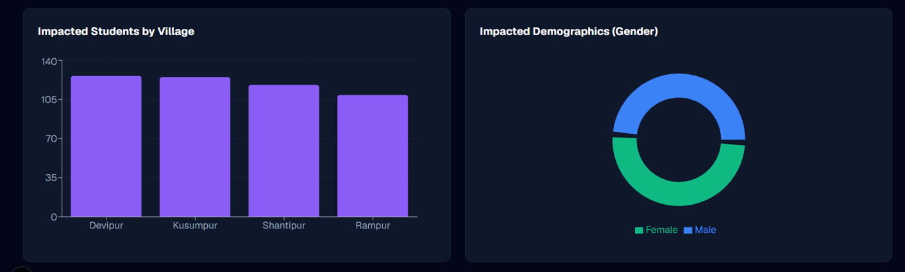

# 📊 Impact Measurement Dashboard

### Transforming NGO Activities into Measurable Outcomes

<p align="center">


</p>

<p align="center">
<b>Challenge 5.1 — Impact Measurement Dashboard for a Partner NGO</b><br>
Analytics & Insights Track
</p>

---

## 📸 Dashboard Preview




---

## 🚀 Key Highlights

* 🎯 Executive KPI: **Cost-per-Impacted Student**
* 📈 Real-time Outcome Tracking
* 🌳 Theory of Change Based KPI Framework
* 🧠 Dynamic Impact Threshold Analysis
* 🌍 Geographic & Demographic Insights
* 📄 One-Click CSR/Donor Reporting
* 🔍 Automated Data Quality Monitoring
* ⚡ Dashboard Load Time Under 3 Seconds

---

## 📑 Table of Contents

* [The Problem](#-the-problem)
* [Our Solution](#-our-solution)
* [Theory of Change](#-theory-of-change)
* [Challenge Questions](#-challenge-questions)
* [Core Features](#-core-features)
* [System Architecture](#-system-architecture)
* [Project Structure](#-project-structure)
* [Data Pipeline](#-data-pipeline)
* [Getting Started](#-getting-started)
* [Success Metrics](#-success-metrics)
* [Future Roadmap](#-future-roadmap)
* [Team](#-team)

---

# 🎯 The Problem

Most NGOs track activities:

* Number of workshops conducted
* Number of beneficiaries reached
* Number of volunteers engaged

However, these metrics do not answer the most important question:

> Are we actually creating measurable impact?

This gap creates challenges in:

* Fundraising
* Program evaluation
* Strategic decision making
* Donor reporting
* Resource allocation

Without outcome-focused measurement, NGOs struggle to identify which interventions truly improve lives.

---

# 💡 Our Solution

The Impact Measurement Dashboard bridges the gap between field operations and leadership decisions.

The platform converts:

```text
Activities
     ↓
Outputs
     ↓
Outcomes
     ↓
Impact
```

into actionable insights through an intuitive dashboard designed for non-technical NGO stakeholders.

The system automatically processes:

* Attendance Records
* Assessment Scores
* Financial Expenses
* Beneficiary Demographics

and transforms them into leadership-ready KPIs.

---

# 🌳 Theory of Change

Our dashboard follows a structured impact framework.

## Activity (Input)

Allocate resources and conduct educational programs.

### Metrics

* Program Budget
* Learning Hours Delivered
* Number of Sessions Conducted

⬇️

## Output (Participation)

Students actively engage in program activities.

### Metrics

* Attendance Rate
* Session Participation Rate
* Student Retention

⬇️

## Outcome (Learning Improvement)

Students demonstrate measurable learning gains.

### Metrics

* Baseline vs Endline Improvement
* Percentage Improvement
* Learning Achievement Rate

⬇️

## Impact (Mission Achievement)

Efficiently improve educational outcomes at scale.

### Metrics

* Cost-per-Impacted Student
* Program Effectiveness Index
* Overall Impact Score

---

# 🧠 Challenge Questions

## 1. What is the one number the Executive Director should check every Monday?

### Cost-per-Impacted Student

Formula:

```text
Cost-per-Impacted Student =
Total Program Cost / Number of Impacted Students
```

Why?

Because it combines:

* Program effectiveness
* Financial efficiency
* Outcome achievement

into a single decision-making metric.

---

## 2. How do we handle data quality issues?

The data pipeline automatically:

* Removes duplicates
* Validates beneficiary records
* Handles missing values
* Standardizes formats
* Normalizes attendance records
* Merges datasets consistently

Data validation occurs before data reaches the dashboard.

---

## 3. What is the right reporting cadence?

| Stakeholder        | Recommended Cadence |
| ------------------ | ------------------- |
| Field Workers      | Weekly              |
| Program Managers   | Weekly              |
| Executive Director | Monthly             |
| Board Members      | Quarterly           |

Monthly review cycles provide more reliable impact trends than daily monitoring.

---

# ✨ Core Features

## 📊 Executive Dashboard

Track organization-wide impact through:

* Cost-per-Impact
* Total Beneficiaries
* Program Performance
* Budget Utilization

---

## 📈 Dynamic KPI Engine

Real-time KPI calculations based on:

* Attendance
* Assessments
* Expenses

Includes adjustable impact threshold controls.

---

## 🌍 Geographic Analytics

Compare impact across:

* Villages
* Districts
* Regions

Visualizations include:

* Scatter Charts
* Bar Charts
* Comparative Analysis

---

## 👥 Demographic Insights

Analyze outcomes by:

* Gender
* Age Group
* Village

Identify underserved communities and intervention opportunities.

---

## 📄 CSR Reporting Engine

Generate professional reports for:

* Donors
* CSR Partners
* Board Meetings
* Funding Applications

---

## 🌙 Dark Mode Interface

Designed specifically for:

* NGO Staff
* Program Managers
* Leadership Teams

with a clean and accessible user experience.

---

# 🏗 System Architecture

```text
Raw NGO Data
(Attendance, Assessments, Expenses)
            │
            ▼
    Python ETL Pipeline
            │
            ▼
  Cleaned Analytics Dataset
            │
            ▼
      KPI Engine
            │
            ▼
   Interactive Dashboard
            │
            ▼
 Executive Decision Making
```

---

# 📂 Project Structure

```text
impact-dashboard/
│
├── scripts/
│   ├── generate_data.py
│   └── transform_data.py
│
├── raw_data/
│   ├── beneficiaries.csv
│   ├── attendance.csv
│   ├── assessments.csv
│   └── expenses.csv
│
├── public/
│   └── final_dashboard_data.csv
│
├── app/
│   ├── page.tsx
│   ├── layout.tsx
│   └── globals.css
│
└── package.json
```

---

# 🚰 Data Pipeline

## Step 1 — Data Generation

**generate_data.py**

Creates realistic synthetic NGO datasets:

* 500 Students
* 4 Villages
* 6-Month Program Duration
* Attendance Logs
* Assessment Scores
* Financial Records

---

## Step 2 — Data Transformation

**transform_data.py**

Calculates:

* Attendance Rate
* Score Improvement
* Impact Metrics
* Program Costs

Outputs:

```text
public/final_dashboard_data.csv
```

This flattened dataset is optimized for fast dashboard rendering.

---

# 🚀 Getting Started

## Prerequisites

* Node.js 18+
* Python 3.9+

---

## Clone Repository

```bash
git clone <your-repository-url>
cd impact-dashboard
```

---

## Install Dependencies

```bash
npm install
```

---

## Start Development Server

```bash
npm run dev
```

Open:

```text
http://localhost:3000
```

---

## Generate Data (Optional)

```bash
cd scripts

python -m venv venv

# Windows
venv\Scripts\activate

# Linux/macOS
source venv/bin/activate

pip install pandas numpy

python generate_data.py

python transform_data.py
```

---

# 📈 Success Metrics

| Metric                        | Target         |
| ----------------------------- | -------------- |
| Dashboard Load Time           | < 3 Seconds    |
| KPI Accuracy                  | 100%           |
| Data Validation               | Automated      |
| Stakeholder Usability Score   | ≥ 8/10         |
| Dashboard Refresh Performance | Near Real-Time |

---

# 🔮 Future Roadmap

## PostgreSQL / Supabase Migration

Transition from flat CSV architecture to a scalable database backend.

---

## Role-Based Access Control

### Field Workers

* Attendance Entry
* Assessment Submission

### Program Managers

* Performance Monitoring
* Resource Allocation

### Executive Directors

* Impact Monitoring
* Strategic Planning

---

## AI-Powered Insights

Automatically generate:

* Weekly Summaries
* Trend Analysis
* Performance Alerts
* Intervention Recommendations

---

## IRIS+ Integration

Align outcomes with globally recognized impact measurement frameworks.

Benefits:

* Better donor reporting
* Easier grant applications
* Improved transparency

---

# 🏆 Expected Impact

This project provides a reusable impact measurement framework that can be adopted by NGOs of different sizes and sectors.

Benefits include:

* Better funding decisions
* Improved program effectiveness
* Stronger donor confidence
* Data-driven leadership
* Scalable impact measurement

---

# 👥 Team

| Name           | Role                                     |
| -------------- | ---------------------------------------- |
| Pranshu Sharma | Data Engineering & Dashboard Development |
| Team Members   | Analytics, Frontend & Impact Design      |

---

<p align="center">
<b>Built for Challenge 5.1 — Impact Measurement Dashboard for a Partner NGO</b><br>
Analytics & Insights Track
</p>
